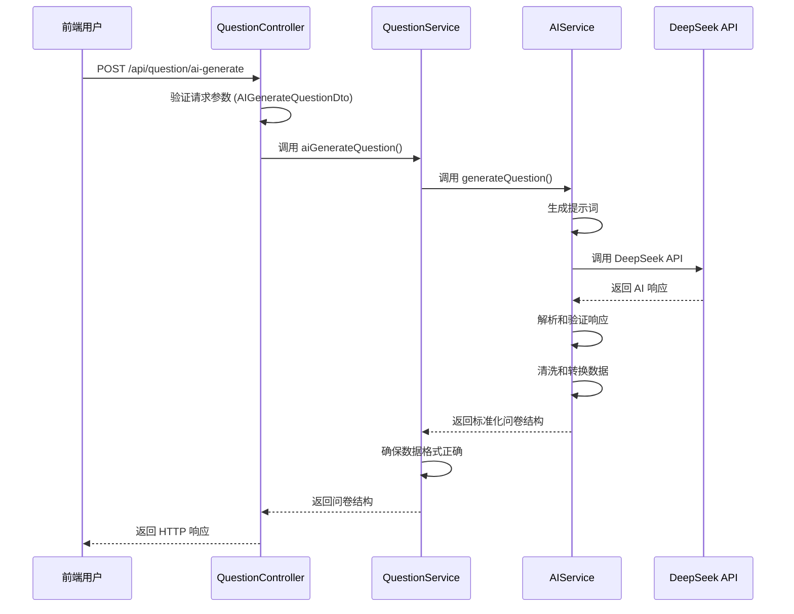

# AI问卷生成功能 - 后端实现文档

## 1. 功能概述

AI问卷生成功能允许用户通过自然语言描述问卷需求，后端服务调用DeepSeek API将描述转换为标准的问卷数据结构，并返回给前端进行预览和应用。

## 2. 技术架构

### 2.1 核心技术栈

- **框架**: NestJS
- **ORM**: Mongoose
- **AI API**: DeepSeek API
- **HTTP客户端**: Axios
- **配置管理**: @nestjs/config
- **ID生成**: nanoid

### 2.2 模块结构

```
src/
├── ai/                    # AI模块
│   ├── ai.module.ts       # AI模块定义
│   └── ai.service.ts      # AI服务实现
├── config/                # 配置模块
│   └── ai.config.ts       # AI配置服务
├── question/              # 问卷模块
│   ├── dto/
│   │   └── ai-generate.dto.ts  # AI生成请求DTO
│   ├── question.controller.ts  # 控制器
│   └── question.service.ts     # 服务
└── auth/                  # 认证模块
    └── decorators/
        └── optional-auth.decorator.ts  # 可选认证装饰器
```

## 3. 核心模块实现

### 3.1 AI配置服务 (`src/config/ai.config.ts`)

**功能**: 管理AI相关的配置，支持通过环境变量配置。

**关键实现**:
- 使用`@nestjs/config`的`ConfigModule`管理配置
- 提供类型安全的配置访问
- 支持环境变量配置，包括API密钥、API地址、模型名称等

**配置项**:
```typescript
interface AIConfig {
  apiKey: string;           // DeepSeek API密钥
  apiUrl: string;           // API地址
  model: string;            // 模型名称
  temperature: number;      // 温度参数
  maxTokens: number;        // 最大token数
}
```

### 3.2 AI服务 (`src/ai/ai.service.ts`)

**功能**: 调用DeepSeek API，将自然语言描述转换为问卷结构。

**关键实现**:
1. **提示词设计**: 
   - 系统提示词：指导AI生成符合规范的问卷结构
   - 用户提示词：包含问卷字段说明和用户描述

2. **API调用**:
   - 使用Axios调用DeepSeek API
   - 配置超时时间、认证头和基础URL

3. **数据验证和清洗**:
   - 验证AI返回的JSON格式
   - 清洗组件数据，确保必需字段存在
   - 转换旧格式（如将`list`转换为`options`）
   - 生成或验证`fe_id`

4. **错误处理**:
   - 处理API调用错误（401、429、500等）
   - 处理JSON解析错误
   - 处理数据验证错误

**核心方法**:
- `generateQuestion()`: 调用AI API生成问卷结构
- `validateAndSanitizeResponse()`: 验证和清洗AI返回的数据
- `getQuestionGenerationPrompt()`: 生成用户提示词

### 3.3 问卷服务 (`src/question/question.service.ts`)

**功能**: 集成AI服务，提供AI生成问卷的业务逻辑。

**关键实现**:
- 调用AI服务生成问卷结构
- 确保生成的问卷结构符合系统规范
- 对齐导入导出格式，确保前后端兼容

**核心方法**:
- `aiGenerateQuestion()`: 调用AI服务生成问卷结构

### 3.4 问卷控制器 (`src/question/question.controller.ts`)

**功能**: 提供AI生成问卷的API接口。

**关键实现**:
- 定义API路由`POST /api/question/ai-generate`
- 使用DTO验证请求参数
- 调用问卷服务生成问卷结构
- 返回标准化的响应格式

**核心方法**:
- `aiGenerate()`: 处理AI生成问卷的HTTP请求

### 3.5 请求DTO (`src/question/dto/ai-generate.dto.ts`)

**功能**: 验证AI生成请求的参数。

**关键实现**:
- 使用`class-validator`验证请求参数
- 确保`prompt`字段是字符串、非空且不超过2000字符

## 4. API接口设计

### 4.1 接口概述

| 路径 | 方法 | 认证 | 描述 |
|------|------|------|------|
| `/api/question/ai-generate` | POST | 需要 | AI生成问卷结构 |

### 4.2 请求参数

```json
{
  "prompt": "创建一个用户满意度调查问卷，包含姓名输入、满意度单选、建议多行文本"
}
```

**参数说明**:
- `prompt`: 字符串，用户的自然语言描述，必填，最大长度2000字符

### 4.3 响应数据

```json
{
  "pageInfo": {
    "title": "用户满意度调查",
    "desc": "请填写您的满意度评价",
    "js": "",
    "css": "",
    "isPublished": false
  },
  "componentList": [
    {
      "fe_id": "abc123",
      "type": "questionInput",
      "title": "姓名",
      "isHidden": false,
      "isLocked": false,
      "props": {
        "placeholder": "请输入您的姓名"
      }
    },
    {
      "fe_id": "def456",
      "type": "questionRadio",
      "title": "满意度",
      "isHidden": false,
      "isLocked": false,
      "props": {
        "options": [
          { "text": "非常满意", "value": "1" },
          { "text": "满意", "value": "2" },
          { "text": "一般", "value": "3" },
          { "text": "不满意", "value": "4" },
          { "text": "非常不满意", "value": "5" }
        ]
      }
    },
    {
      "fe_id": "ghi789",
      "type": "questionTextarea",
      "title": "建议",
      "isHidden": false,
      "isLocked": false,
      "props": {
        "placeholder": "请输入您的宝贵建议"
      }
    }
  ]
}
```

## 5. 数据流



## 6. 错误处理

### 6.1 错误类型

| 错误类型 | HTTP状态码 | 描述 |
|----------|------------|------|
| 参数验证错误 | 400 | prompt不能为空或长度超过2000字符 |
| API密钥无效 | 400 | DeepSeek API密钥无效 |
| 请求频率过高 | 400 | DeepSeek API请求频率过高 |
| AI服务不可用 | 400 | DeepSeek API暂时不可用 |
| JSON格式错误 | 400 | AI返回的JSON格式错误 |
| 数据验证错误 | 400 | AI返回的数据不符合规范 |

### 6.2 错误响应格式

```json
{
  "statusCode": 400,
  "message": "prompt 不能为空",
  "error": "Bad Request"
}
```

## 7. 配置说明

### 7.1 环境变量配置

在项目根目录创建`.env`文件，配置以下环境变量：

```env
# DeepSeek API 密钥（必填）
DEEPSEEK_API_KEY=your_deepseek_api_key_here

# API 地址（可选，默认：https://api.deepseek.com/v1/chat/completions）
DEEPSEEK_API_URL=https://api.deepseek.com/v1/chat/completions

# 模型名称（可选，默认：deepseek-chat）
DEEPSEEK_MODEL=deepseek-chat

# 温度参数（可选，默认：0.7，范围：0-2）
DEEPSEEK_TEMPERATURE=0.7

# 最大 token 数（可选，默认：2000）
DEEPSEEK_MAX_TOKENS=2000
```

### 7.2 配置优先级

1. 环境变量
2. 默认值

## 8. 测试方法

### 8.1 启动服务

```bash
npm run start:dev
```

### 8.2 API测试

使用curl或Postman测试API：

```bash
curl -X POST http://localhost:3005/api/question/ai-generate \
  -H "Content-Type: application/json" \
  -H "Authorization: Bearer YOUR_JWT_TOKEN" \
  -d '{
    "prompt": "创建一个用户满意度调查问卷，包含姓名输入、满意度单选、建议多行文本"
  }'
```

### 8.3 测试用例

| 测试场景 | 输入 | 预期结果 |
|----------|------|----------|
| 正常生成 | 有效的问卷描述 | 返回标准问卷结构 |
| 空prompt | `{ "prompt": "" }` | 返回400错误，提示"prompt 不能为空" |
| 过长prompt | `{ "prompt": "x".repeat(2001) }` | 返回400错误，提示"prompt 长度不能超过2000字符" |
| 无效API密钥 | 配置无效的API密钥 | 返回400错误，提示"AI API 密钥无效" |

## 9. 安全注意事项

1. **API密钥保护**:
   - API密钥通过环境变量配置，不硬编码在代码中
   - `.env`文件添加到`.gitignore`，不会提交到版本控制

2. **请求验证**:
   - 所有请求必须经过认证（除了公开接口）
   - 请求参数经过严格验证

3. **数据清洗**:
   - AI返回的数据经过严格验证和清洗
   - 确保返回的数据符合系统规范

## 10. 性能优化

1. **超时设置**: API请求超时时间设置为60秒，避免长时间阻塞
2. **参数限制**: 限制prompt长度为2000字符，避免生成过大的问卷
3. **缓存机制**: （可选）添加缓存机制，避免重复请求相同的prompt
4. **异步处理**: 使用异步/await处理API请求，提高并发性能

## 11. 扩展建议

1. **支持多种AI模型**: 扩展代码，支持多种AI模型（如OpenAI、Claude等）
2. **添加历史记录**: 保存用户生成的问卷历史，支持复用和修改
3. **优化提示词**: 不断优化提示词，提高AI生成问卷的质量
4. **添加模板库**: 建立问卷模板库，用户可以基于模板生成问卷
5. **支持自定义组件**: 允许用户指定生成特定类型的组件

## 12. 总结

AI问卷生成功能通过NestJS框架和DeepSeek API实现了从自然语言到问卷结构的转换，提供了完整的配置、验证、错误处理和测试机制。该功能可以帮助用户快速生成问卷结构，提高问卷设计效率。

后端实现遵循了NestJS的最佳实践，包括模块化设计、依赖注入、类型安全和错误处理，确保了代码的可维护性和扩展性。