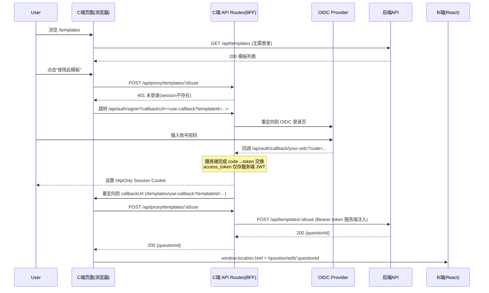

# 模板系统（B 端创建、C 端公开展示、使用模板创建问卷）+ SSO（Next.js BFF + Token）落地方案

> 目标：
>
> - C 端（Next.js）公开展示问卷模板，无需登录即可浏览。
> - 点击"使用此模板"时，需要登录；登录后由后端克隆模板生成"我的问卷"，并跳转到 B 端编辑页 `/question/edit/:questionId`。
> - 模板只能由管理员在 B 端后台创建/管理。
> - B 端与 C 端使用统一的认证中心实现 Token-based SSO；**认证中心（BFF 层）直接由 C 端 Next.js 的 API Routes 承担**，无需独立部署认证服务，通过 `next-auth` 实现 OIDC 流程，access_token 始终保留在服务端，浏览器仅持有 httpOnly 加密 Session Cookie。

---

## 1. 现状与边界

### 1.1 你当前本地结构（典型）

- B 端：React 管理后台（本仓库：`react-ts-questions`），负责问卷编辑、管理。
- 后端：提供 `/api/**` 的业务接口。
- C 端：Next.js（单独项目/单独端口），负责面向访客的模板展示与“使用模板”的入口。

### 1.2 核心设计原则

1. **模板本质是问卷结构的快照**：至少包含 `title/desc/js/css/componentList`。
2. **“使用模板”必须由后端执行克隆**：避免前端承担归属/权限/审计字段初始化等复杂职责。
3. **登录态判断以“受保护接口返回 401/403”为准**：不要让 C 端仅靠本地缓存/猜测是否登录。
4. **SSO 的本质是：统一签发 Token + 统一校验 Token**：B/C 端都是 OAuth2/OIDC 客户端（或同等能力），后端作为 Resource Server 校验 Token。

---

## 2. 数据模型设计（推荐：模板=问卷的一种类型）

> 方案选择：**模板与问卷复用同一套 schema/存储结构**，通过字段区分。

### 2.1 数据库字段（以 Question 为核心实体）

在 `question`（或集合）新增模板相关字段：

- `isTemplate: boolean`
  - `false`：普通问卷
  - `true`：模板
- `templateStatus?: 'draft' | 'published'`
  - `draft`：仅管理员可见（草稿）
  - `published`：C 端可见（公开模板）
- `templateDesc?: string`
  - C 端卡片展示用的描述文案
- 可选增强字段（不影响 MVP）：
  - `cover?: string`（封面图 URL）
  - `category?: string`（分类）
  - `tags?: string[]`
  - `sort?: number`（排序权重）

仍复用现有问卷结构字段：

- `title: string`
- `desc: string`
- `js: string`
- `css: string`
- `componentList: ComponentInfo[]`

### 2.2 约束与权限

- **只有 admin** 能创建/修改模板（`isTemplate=true` 的记录）。
- 普通用户的“问卷列表/回收站/星标”等业务接口应默认过滤掉模板（避免混入）。
- 模板公开展示只暴露必要字段：
  - 列表：`id/title/templateDesc/cover/componentList 摘要/createdAt` 等
  - 详情：可返回完整 `componentList` 以支持预览渲染

---

## 3. API 契约（后端）

> 本节以“路由建议 + 权限 + 入参/出参”描述，便于前后端对齐。

### 3.1 C 端公开接口（无需登录）

#### 3.1.1 模板列表

`GET /api/templates`

- Query（可选）：
  - `page`、`pageSize`
  - `keyword`（标题/描述搜索）
  - `category`、`tag`（如有）
- 返回：

```json
{
  "list": [
    {
      "id": "tpl_1",
      "title": "活动报名",
      "templateDesc": "适合报名、预约、活动收集",
      "cover": "https://...",
      "componentSummary": [
        { "type": "questionTitle", "count": 1 },
        { "type": "questionInput", "count": 3 }
      ],
      "createdAt": "2026-02-09T..."
    }
  ],
  "count": 100,
  "page": 1,
  "pageSize": 12
}
```

> 说明：列表建议返回 `componentSummary`（后端聚合/前端聚合均可），避免 `componentList` 过大影响首屏。

#### 3.1.2 模板详情（预览）

`GET /api/templates/:id`

- 返回（示例）：

```json
{
  "id": "tpl_1",
  "title": "活动报名",
  "templateDesc": "适合报名、预约、活动收集",
  "desc": "...",
  "js": "",
  "css": "",
  "componentList": [
    { "fe_id": "xxx", "type": "questionTitle", "title": "标题", "props": {} },
    {
      "fe_id": "yyy",
      "type": "questionInput",
      "title": "姓名",
      "props": { "placeholder": "" }
    }
  ]
}
```

> C 端可以做“模板预览页”，也可以仅在卡片里展示摘要。

### 3.2 “使用模板”接口（需要登录）

#### 3.2.1 使用模板创建问卷（强推荐的核心接口）

`POST /api/templates/:id/use`

- Auth：需要登录（Bearer Token）
- 行为：
  1. 校验模板存在且 `templateStatus=published`
  2. 克隆模板为新问卷（owner=currentUser）
  3. 返回新问卷 id

- 返回：

```json
{ "questionId": "q_10001" }
```

- 克隆规则（建议）：
  - `isTemplate=false`
  - `isPublished=false`
  - `auditStatus='Draft'`（或你现有默认）
  - `isStar=false`（默认）
  - **重置/不继承**：统计数据、featured/pinned 等运营字段
  - **componentList 需要重新生成每个组件的 fe_id**（避免编辑器 key 冲突）

> 注意：不要在前端克隆 `fe_id`。后端生成更可靠（或后端返回后由 B 端加载时重新标准化）。

### 3.3 B 端管理员接口（需要 admin 权限）

#### 3.3.1 管理员模板列表

`GET /api/admin/templates`

- 返回包含 draft + published，支持查询/分页。

#### 3.3.2 创建模板

`POST /api/admin/templates`

- 两种创建方式：
  1. **从空模板创建**：body 包含 `title/templateDesc/componentList...`
  2. **从现有问卷保存为模板**（可选更好用）：
     - `POST /api/admin/templates/from-question/:questionId`

#### 3.3.3 更新/发布/下线

- `PATCH /api/admin/templates/:id`（更新 title/desc/templateDesc/componentList）
- `POST /api/admin/templates/:id/publish`
- `POST /api/admin/templates/:id/unpublish`

#### 3.3.4 管理员模板详情（编辑/预览）

`GET /api/admin/templates/:id`

> 此接口用于后台编辑模板，不受 `templateStatus` 限制。

---

## 4. 前端落地（B 端 React + C 端 Next.js）

### 4.1 B 端（本仓库）落地建议

#### 4.1.1 页面与路由

- 新增“模板管理”入口：`/manage/templates`
  - 页面结构可复用现有 `AdminQuestions` Table 交互（查询、分页、操作列）。
- 新增/复用模板编辑方式：
  - **推荐直接复用现有问卷编辑器**：
    - 编辑器本质编辑的是 `pageInfo + componentList`
    - 保存时写入 `isTemplate=true`、`templateStatus` 等字段

> 如果编辑器强依赖“问卷”语义（发布、审核等），建议在模板编辑页隐藏这些不相关按钮。

#### 4.1.2 Service 层

- 新增：`src/services/template.ts`（仅建议，便于与 question/admin 分层）
  - `getAdminTemplateListService`
  - `createAdminTemplateService`
  - `updateAdminTemplateService`
  - `publishAdminTemplateService`
  - `unpublishAdminTemplateService`

### 4.2 C 端（Next.js）落地建议

#### 4.2.1 模板列表页

- 页面：`/templates`
- 特性：
  - 无需登录即可访问
  - 展示模板卡片：标题、描述、基础结构摘要
  - Hover 显示“使用此模板”按钮

卡片展示“基础结构”的实现方式：

- 方式 1（推荐）：后端在列表接口直接返回 `componentSummary`
- 方式 2：前端对 `componentList` 做聚合（若列表返回了 componentList，不推荐）

#### 4.2.2 点击“使用此模板”的行为（核心）

- 直接调用：`POST /api/templates/:id/use`
- 成功：拿到 `questionId`，跳转 B 端编辑页：
  - `window.location.href = `${B_APP_ORIGIN}/question/edit/${questionId}``
- 失败：
  - 401（未登录）→ 跳转到 B 端 SSO 登录入口（详见 SSO 部分）
  - 403（无权限/模板下线）→ 给出友好提示

> 重要：不要在 C 端“猜是否登录”。以 `/use` 接口返回为准。

---

## 5. SSO（Next.js BFF + next-auth）方案

> 目标：
>
> - **认证 BFF 由 C 端 Next.js API Routes 承担**，无需独立部署 Auth Center 服务。
> - `next-auth` 在服务端完成 OIDC code → token 交换，access_token 永远不暴露给浏览器。
> - C 端不做独立登录页，触发登录时跳转到 C 端自身的 `next-auth` 登录入口，完成后可跨域回跳 B 端。
> - 后端 API 通过校验 Token 鉴权（Token 由 BFF 代理注入，不经过浏览器）。

### 5.1 架构角色

```
C端 Next.js
├── 页面层（浏览器）          ← 只持有加密的 httpOnly Session Cookie，无 access_token
└── API Routes（BFF 服务端）
    ├── /api/auth/[...nextauth]  ← next-auth 提供：登录/回调/登出/session 查询
    └── /api/proxy/[...path]    ← （可选）代理业务接口，服务端注入 Bearer token

B端（React）                 ← 触发登录时重定向到 C端 /api/auth/signin
后端 API（Resource Server）  ← 校验 Bearer token（由 Next.js BFF 在服务端注入）
OIDC Provider               ← 负责最终的身份认证与签发 access_token
                               （可以是你自建的 Auth Server，或复用现有后端 /api/login）
```

**核心变化**：OIDC Authorization Code Flow 的 `code → token` 交换**发生在 Next.js 服务端**，浏览器只看到一个 `httpOnly Secure` Session Cookie，access_token 始终不落地前端。

### 5.2 next-auth 接入（C 端核心代码）

**安装**：

```bash
npm install next-auth
```

**配置**（`app/api/auth/[...nextauth]/route.ts`，App Router）：

```ts
import NextAuth from 'next-auth';

export const { handlers, auth, signIn, signOut } = NextAuth({
  providers: [
    {
      id: 'your-oidc',
      name: '统一认证',
      type: 'oidc',
      issuer: process.env.OIDC_ISSUER,
      clientId: process.env.OIDC_CLIENT_ID,
      clientSecret: process.env.OIDC_CLIENT_SECRET,
    },
  ],
  session: { strategy: 'jwt' }, // token 存加密的 httpOnly cookie，不发给浏览器
  callbacks: {
    async jwt({ token, account }) {
      // access_token 仅存在服务端 JWT 负载中，不暴露给浏览器
      if (account) token.accessToken = account.access_token;
      return token;
    },
    async session({ session, token }) {
      // 发给浏览器的 session 只含脱敏用户信息（无 access_token）
      session.user.id = token.sub!;
      return session;
    },
  },
});

export const { GET, POST } = handlers;
```

`next-auth` 自动提供以下路由：

| 路由                               | 说明                                    |
| ---------------------------------- | --------------------------------------- |
| `GET /api/auth/signin`             | 登录入口，触发 OIDC 跳转                |
| `GET /api/auth/callback/your-oidc` | OIDC 回调，服务端完成 code 换 token     |
| `POST /api/auth/signout`           | 登出，清除 session cookie               |
| `GET /api/auth/session`            | 返回当前登录用户信息（供 B 端跨域查询） |

**必要的环境变量**：

```env
# C端 .env.local
NEXTAUTH_SECRET=<openssl rand -base64 32>   # 必须设置，加密 session cookie
NEXTAUTH_URL=https://your-c-app.com
OIDC_ISSUER=https://your-auth-server.com
OIDC_CLIENT_ID=xxx
OIDC_CLIENT_SECRET=xxx
BACKEND_API_BASE=https://your-api.com
```

> **暂无独立 OIDC Provider 的过渡方案**：可用 `next-auth` 的 `Credentials Provider`，直接对接现有后端 `/api/login` 接口，先把 BFF 模式建立起来，后续再切换到标准 OIDC Provider：
>
> ```ts
> import Credentials from 'next-auth/providers/credentials';
>
> providers: [
>   Credentials({
>     async authorize(credentials) {
>       const res = await fetch(`${process.env.BACKEND_API_BASE}/api/login`, {
>         method: 'POST',
>         headers: { 'Content-Type': 'application/json' },
>         body: JSON.stringify(credentials),
>       });
>       const user = await res.json();
>       return res.ok ? user : null;
>     },
>   }),
> ];
> ```

### 5.3 业务接口代理（可选但推荐）

为了让 Bearer token 完全不落到浏览器，在 Next.js 里增加代理层，由服务端注入 Authorization Header：

```ts
// app/api/proxy/[...path]/route.ts
import { auth } from '@/auth';
import { NextRequest, NextResponse } from 'next/server';

async function proxyRequest(req: NextRequest) {
  const session = await auth();
  if (!session) return NextResponse.json({ errno: 401 }, { status: 401 });

  const path = req.nextUrl.pathname.replace('/api/proxy', '');
  const search = req.nextUrl.search;
  const backendRes = await fetch(
    `${process.env.BACKEND_API_BASE}${path}${search}`,
    {
      method: req.method,
      headers: {
        'Content-Type': 'application/json',
        Authorization: `Bearer ${(session as { accessToken?: string }).accessToken}`,
      },
      body: req.method !== 'GET' ? await req.text() : undefined,
    }
  );
  const data = await backendRes.json();
  return NextResponse.json(data, { status: backendRes.status });
}

export const GET = proxyRequest;
export const POST = proxyRequest;
export const PATCH = proxyRequest;
export const DELETE = proxyRequest;
```

C 端页面只调用 `/api/proxy/templates`，access_token 永远不离开 Next.js 服务端。

### 5.4 登录与回跳设计（关键）

**登录入口统一为 C 端 BFF**：

- `C_APP_ORIGIN/api/auth/signin?callbackUrl=<urlEncoded>`

**B 端触发登录**（替代原来的独立 Auth Center 入口）：

1. B 端检测到 401，或用户主动点击登录
2. 跳转到 C 端：`${C_APP_ORIGIN}/api/auth/signin?callbackUrl=${encodeURIComponent(returnTo)}`
3. `next-auth` 在服务端完成 OIDC 登录 + code 换 token
4. 登录成功后自动重定向到 `callbackUrl`（即 `returnTo`）

> **跨域 Cookie 注意事项**：
>
> - 若 B 端（`app.example.com`）与 C 端（`www.example.com`）在同一父域，可设置 `cookie.domain = '.example.com'`，session cookie 可共享。
> - 若不同域，B 端需通过调用 `C端/api/auth/session`（需配置 CORS 白名单）获取当前登录用户信息，再维护自己的轻量 session。
> - **推荐部署策略**：将 B 端与 C 端统一在同一父域下，彻底消除跨域问题。

#### 5.4.1 C 端触发登录的 callbackUrl

当 C 端点击"使用模板"，`/use` 返回 401：

- 跳转到（C 端自身的 next-auth 登录入口）：

```
${C_APP_ORIGIN}/api/auth/signin?callbackUrl=${encodeURIComponent(
  C_APP_ORIGIN + '/templates/use-callback?templateId=xxx'
)}
```

然后在 C 端实现 `/templates/use-callback` 页面：

- 页面加载后自动调用 `POST /api/proxy/templates/:id/use`（走 BFF 代理）
- 成功后跳转 B 端编辑页：`${B_APP_ORIGIN}/question/edit/${questionId}`
- 失败显示错误提示

### 5.5 后端鉴权

后端对受保护接口（例如 `POST /api/templates/:id/use`）要求：

- 必须携带有效的 `Authorization: Bearer <access_token>`（由 Next.js BFF 在服务端注入）
- 需要能识别 `userId`、`role`
- 具备基本鉴权能力：
  - token 过期 → 401
  - token 无权限 → 403

模板管理接口（`/api/admin/templates/**`）必须校验 `role=admin`。

---

## 6. 端到端用户流程（含时序）

### 6.1 流程 A：未登录用户使用模板



### 6.2 流程 B：已登录用户使用模板

- C 端 `POST /api/proxy/templates/:id/use` → BFF 检测到 session 有效 → 服务端注入 token 转发 → 拿到 `questionId` → 跳 B 端编辑页。

---

## 7. 安全与风控要点（务必考虑）

1. **模板公开接口只读**：只返回 `published` 模板。
2. **/use 接口必须登录**：否则任何人都能批量创建问卷刷库。
3. **限流/防刷**：对 `/use` 做简单频控（例如同 IP/同用户短时间内限制）。
4. **克隆时重新生成 fe_id**：否则编辑器里拖拽 key 冲突、组件定位错乱。
5. **Token 安全（已由 BFF 架构保证）**：
   - access_token 由 Next.js BFF 持有，浏览器只有加密的 httpOnly Session Cookie
   - `NEXTAUTH_SECRET` 必须使用足够强度的随机密钥（`openssl rand -base64 32`）
   - Session Cookie 需设置 `Secure`（HTTPS）、`SameSite=Lax`
   - **绝对不要** 在 `session` 回调中把 `accessToken` 暴露给浏览器端的 session 响应

---

## 8. 最小落地里程碑（建议按 1~2 天可交付拆）

### Milestone 1（MVP）

- 后端：
  - `GET /api/templates`
  - `GET /api/templates/:id`
  - `POST /api/templates/:id/use`（登录鉴权 + 克隆）
- B 端：
  - 最简单的 admin 模板管理（可先通过接口或脚本创建模板）
- C 端：
  - 安装 `next-auth` 并配置 `app/api/auth/[...nextauth]/route.ts`
  - 配置 `/api/proxy/[...path]` 代理路由，服务端注入 Bearer token
  - 模板列表页 + 使用模板按钮
  - `POST /api/proxy/templates/:id/use` 返回 401 时跳转 `/api/auth/signin?callbackUrl=...`
  - 回跳页 `/templates/use-callback`

### Milestone 2（管理完善）

- B 端模板管理页面（创建/编辑/发布/下线/删除）
- 模板卡片更丰富的摘要信息（componentSummary/封面/标签）

---

## 9. 前后端联调 checklist

- [ ] C 端 `GET /api/templates` 不需要登录，且只返回 published
- [ ] C 端点击使用 `POST /api/proxy/templates/:id/use`：session 不存在时 BFF 返回 401
- [ ] 401 时跳转 C 端 `/api/auth/signin?callbackUrl=...` 能经 OIDC 登录后回跳 `/templates/use-callback`
- [ ] callback 页面能读取 `templateId` 并再次调用 `/use` 成功
- [ ] `/use` 成功后返回 questionId，跳转 B 端编辑页能加载到问卷详情
- [ ] 新问卷 owner 正确，isPublished/auditStatus 初始值正确
- [ ] `NEXTAUTH_SECRET` 已配置，session cookie 为 httpOnly + Secure
- [ ] BFF 代理路由能正确将 access_token 注入 Authorization Header

---

## 10. 附：接口与类型对齐建议（前端 TypeScript）

建议在前端对模板接口建模（无论在 B 端还是 C 端项目）：

```ts
export type TemplateListItem = {
  id: string;
  title: string;
  templateDesc?: string;
  cover?: string;
  componentSummary?: Array<{ type: string; count: number }>;
  createdAt: string;
};

export type TemplateDetail = {
  id: string;
  title: string;
  templateDesc?: string;
  desc: string;
  js: string;
  css: string;
  componentList: Array<{
    fe_id: string;
    type: string;
    title: string;
    props: Record<string, unknown>;
    isHidden?: boolean;
    isLocked?: boolean;
  }>;
};

export type UseTemplateRes = {
  questionId: string;
};
```

> `componentList` 的具体类型可以直接复用你现有的 `ComponentInfoType`（B 端这边已经有）。

---

## 11. 结论

- **`POST /templates/:id/use` → 返回 `questionId` → 跳 B 编辑页** 是最稳的端到端"使用模板"流程，保持不变。
- **认证 BFF 由 C 端 Next.js API Routes 承担**，通过 `next-auth` 实现完整 OIDC 流程，无需独立部署 Auth Center 服务，显著降低运维复杂度。
- **access_token 始终在服务端**，浏览器只持有 `next-auth` 签发的加密 httpOnly Session Cookie，达到 BFF 模式的最高安全标准。
- C 端无需独立登录页；触发 401 时统一跳转至 C 端自身的 `next-auth` 登录入口（`/api/auth/signin`），登录完成后经 `callbackUrl` 回跳，自动继续"使用模板"动作。
- **过渡路径**：若暂无独立 OIDC Provider，可先用 `Credentials Provider` 对接现有后端 `/api/login`，后续平滑切换至标准 OIDC，BFF 架构代码几乎不需改动。
