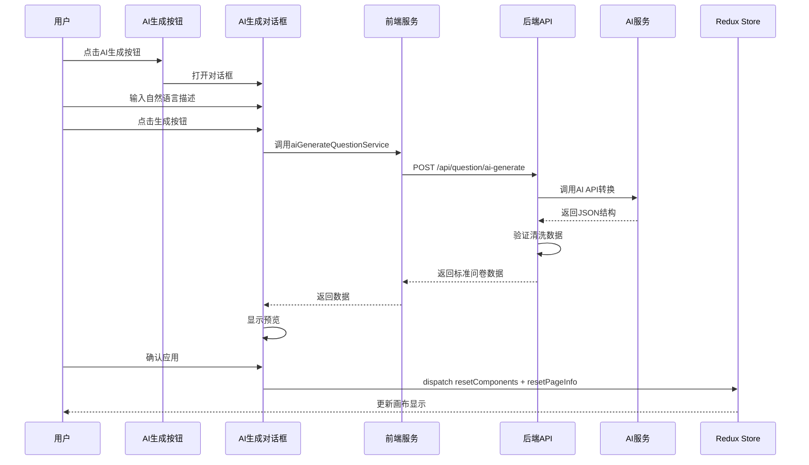

#AI问卷生成功能实现方案

## 功能概述

在编辑问卷页面添加AI生成功能，用户通过自然语言描述问卷需求，AI将其转换为标准的问卷数据结构，支持预览确认后再应用。

## 技术架构

### 1. 后端接口设计

创建新的后端API接口：

- **接口路径**: `POST /api/question/ai-generate`
- **请求参数**: 
  ```typescript
      {
        prompt: string; // 用户的自然语言描述
      }
  ```


- **返回数据结构**: 对齐现有的导入导出格式
  ```typescript
      {
        pageInfo: {
          title: string;
          desc?: string;
          js?: string;
          css?: string;
          isPublished?: boolean;
        };
        componentList: Array<{
          fe_id: string;
          type: string;
          title: string;
          isHidden?: boolean;
          isLocked?: boolean;
          props: ComponentPropsType;
        }>;
      }
  ```


后端需要：

1. 接收前端请求的自然语言描述
2. 调用AI API（OpenAI/Claude等），使用Prompt将自然语言转换为JSON结构
3. 验证和清洗返回的JSON数据，确保符合问卷结构规范
4. 返回标准化的问卷数据

### 2. 前端实现

#### 2.1 文件结构

```javascript
src/pages/question/Edit/EditHeader/
  └── EditAIGenerateButton/
      ├── index.tsx              # 按钮组件
      └── AIGenerateModal.tsx    # AI生成对话框组件
```


#### 2.2 核心文件

**`src/services/question.ts`**

- 添加 `aiGenerateQuestionService(prompt: string)` 函数，调用后端AI接口

**`src/pages/question/Edit/EditHeader/EditAIGenerateButton/index.tsx`**

- 在EditHeader右侧添加"AI生成"按钮（放在导入导出按钮旁边）
- 点击按钮打开Modal对话框

**`src/pages/question/Edit/EditHeader/EditAIGenerateButton/AIGenerateModal.tsx`**

- Modal对话框组件，包含：
- 输入框：用户输入自然语言描述（支持多行）
- 生成按钮：调用AI接口
- 加载状态：生成过程中显示loading
- 预览区域：显示生成的问卷结构（可选，或直接预览在画布）
- 确认/取消按钮：确认后应用，取消则关闭

#### 2.3 UI设计

**按钮位置**: EditHeader右侧，在导入/导出按钮之间或后面**Modal对话框布局**:

```javascript
┌─────────────────────────────────────┐
│  AI生成问卷                [×]      │
├─────────────────────────────────────┤
│                                      │
│  描述你的问卷需求：                  │
│  ┌──────────────────────────────┐   │
│  │                              │   │
│  │  例如：创建一个用户满意度    │   │
│  │  调查问卷，包含姓名输入、    │   │
│  │  满意度单选、建议多行文本    │   │
│  │                              │   │
│  └──────────────────────────────┘   │
│                                      │
│  [生成问卷]                          │
│                                      │
│  ┌─ 预览区域（生成后显示）──────┐   │
│  │  问卷标题：用户满意度调查    │   │
│  │  1. 输入框：姓名             │   │
│  │  2. 单选：满意度（满意/一般）│   │
│  │  3. 多行文本：建议           │   │
│  └──────────────────────────────┘   │
│                                      │
│           [取消]  [确认应用]         │
└─────────────────────────────────────┘
```


#### 2.4 数据流




#### 2.5 实现细节

**参考导入功能** (`src/pages/question/Edit/EditHeader/EditImportButton/index.tsx`)：

- 使用类似的逻辑处理AI返回的数据
- 使用 `resetComponents` 和 `resetPageInfo` 更新状态
- 使用 `ActionCreators.clearHistory()` 清除撤销历史
- 可选：调用 `importIntoQuestionService` 保存到服务器

**状态管理**：

- 使用 `useState` 管理Modal的显示/隐藏
- 使用 `useRequest` (ahooks) 管理API请求和loading状态
- 使用 `useDispatch` 更新Redux状态

**错误处理**：

- AI生成失败时显示错误提示
- 数据格式验证失败时提示用户重新生成
- 网络错误处理

### 3. AI Prompt设计

后端需要设计的Prompt示例：

```javascript
你是一个问卷设计专家。请根据用户的自然语言描述，生成符合以下JSON格式的问卷结构：

问卷字段说明：
- pageInfo: 问卷页面信息
    - title: 问卷标题（必填）
    - desc: 问卷描述（可选）
- componentList: 组件列表，每个组件包含：
    - fe_id: 唯一ID（生成随机字符串）
    - type: 组件类型，可选值：
        - questionInput: 单行输入框
        - questionTextarea: 多行输入框
        - questionTitle: 标题
        - questionParagraph: 段落文本
        - questionInfo: 信息展示
        - questionRadio: 单选题
        - questionCheckbox: 多选题
    - title: 组件标题
    - props: 组件属性（根据组件类型不同而不同）

请将用户的描述转换为JSON格式，确保数据完整和格式正确。
```


### 4. 代码改动清单

#### 需要创建的文件：

1. `src/services/question.ts` - 添加 `aiGenerateQuestionService` 函数
2. `src/pages/question/Edit/EditHeader/EditAIGenerateButton/index.tsx` - 按钮组件
3. `src/pages/question/Edit/EditHeader/EditAIGenerateButton/AIGenerateModal.tsx` - 对话框组件

#### 需要修改的文件：

1. `src/pages/question/Edit/EditHeader/index.tsx` - 引入并添加AI生成按钮

## 注意事项

1. **API密钥安全**: 后端统一管理AI API密钥，前端不直接调用AI服务
2. **数据验证**: 后端需要对AI返回的数据进行严格验证，确保符合系统规范
3. **错误处理**: 提供友好的错误提示，引导用户重新描述或调整